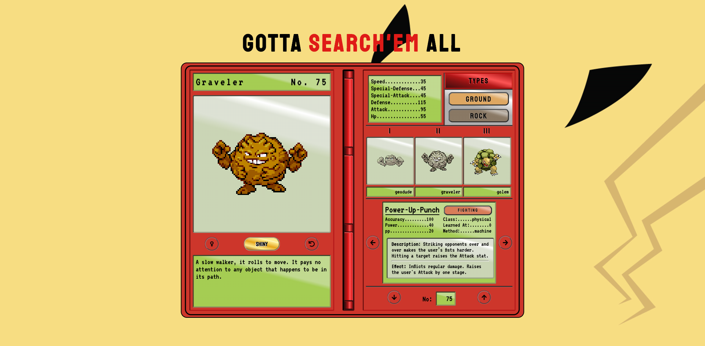

# Gotta Search'EM All

[](https://app.netlify.com/sites/gotta-search-em-all/deploys)



## Getting Started

Visit to see the live app https://gotta-search-em-all.netlify.app/

### Prerequisites

`Git & NPM`

### Installation steps

```zsh
# clone the repo
git clone https://github.com/shimphillip/gotta-search-em-all.git

# navigate to the directory
cd gotta-search-em-all

# install packages
npm install or yarn

# start the app
npm run start or yarn start
```

## Running the tests

No tests 😿

## Deployment

Easy deployment with netlify :)

## Built With

- React and its hooks
- Emotion.js

## Contributing

Issues and PR's welcome!

## Versioning

1.0.0

## Authors

- **Phillip Shim**

## License

This project is licensed under the MIT License - see the [LICENSE.md](LICENSE.md) file for details

## Acknowledgments

1. https://codepen.io/siliconunicorn/pen/VqoxXP - Huge inspiration from here

2. https://codepen.io/animeshk874/pen/WGpAkj for the pokemon loader animation

3. https://nostalgic-css.github.io/NES.css/ Pokeball sprites frm Nes.css

4. https://github.com/klaussinani/hyper-pokemon Background wallpaper

5. https://pokeapi.co/ PokeAPI
